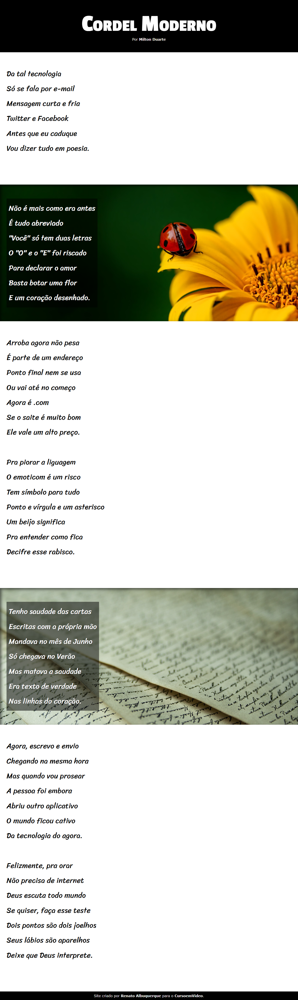

# Cordel Project - Mentor Gustavo Guanabara.

## Challenge 12 - HTML5 and CSS3 Course

Project developed during the HTML5 and CSS3 course, module 3 of 5, in Sep/22.

🔗 [Click here to access](https://renato-albuquerque.github.io/projeto-cordel/)

## Technologies

- HTML
- CSS
- Git and Github

## Contact

🔗 [Linkedin](https://www.linkedin.com/in/renato-malbuquerque/)
🔗 [Business Card](https://rma-contacts.vercel.app/)
🔗 [Portfolio](https://portfolio-renatoalbuquerque.vercel.app/)
🔗 [Discord](https://discordapp.com/users/992621595547938837)